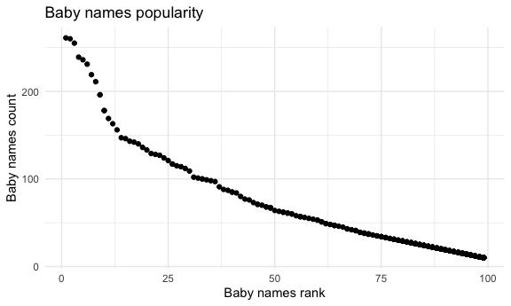

p8105\_hw2\_qz2392
================
Qimin Zhang
9/25/2019

# Problem 1

Read the data in Mr.Trash Wheel sheet without rows and columns with
notes, and build pipeline for cleaning tha data.

``` r
mrtrashwheel = 
  read_excel(
    "./Datasets/Trash-Wheel-Collection-Totals-8-6-19.xlsx", 
    range = "A2:N406") %>%
  janitor::clean_names() %>%
  drop_na("dumpster") %>%
  mutate(
    sports_balls = as.integer(round(sports_balls))
    )
```

Read and clean the data in 2017 and 2018 Precipitation sheet.

``` r
#Read and clean the 2017 Precipitation sheet
pre_2017 =
  read_excel(
    "./Datasets/Trash-Wheel-Collection-Totals-8-6-19.xlsx", sheet = "2017 Precipitation", 
    range = "A2:B14") %>%
  janitor::clean_names() %>%
  drop_na("total") %>%
  mutate(
    year = 2017
    )

#Read and clean the 2018 Precipitation sheet
pre_2018 =
  read_excel(
    "./Datasets/Trash-Wheel-Collection-Totals-8-6-19.xlsx", 
    sheet = "2018 Precipitation", 
    range = "A2:B14") %>%
  janitor::clean_names() %>%
  drop_na("total") %>%
  mutate(
    year = 2018
    )

#Combine the precipitation sheets and convert the month variable into character type.
pre_2017_and_2018 =
  bind_rows(pre_2017, pre_2018) %>%
  janitor::clean_names() %>%
  mutate(
    month = month.name[month]
  )
```

The number of observations in Mr.Trash Wheel dataset is `344` and the
number of observations in precipitation data for 2017 and 2018 is `24`.
The key variables in Mr.Trash Wheel dataset might include ‘weight\_tons’
and ‘homes\_powered’, and the key variables in precipitation data for
2017 and 2018 might include ‘month’ and ‘total’. The total precipitation
in 2018 is 70.33, and the median number of sports balls in a dumpster in
2017 is 8.

# Problem 2

First to clean the dataset pols-month.

``` r
pols_month =
  read_csv("./Datasets/fivethirtyeight_datasets/pols-month.csv") %>%
  janitor::clean_names() %>%
  separate(mon, c('year', 'month', 'day'), sep = '-') %>%
  mutate(
    year = as.integer(year),
    month = month.name[as.integer(month)],
    day = as.integer(day),
    president = case_when(
  prez_gop > 0 ~ 'gop',
  prez_dem > 0 ~ 'dem'
)
  ) %>%
  select(-c(day,prez_dem, prez_gop))
```

Then to clean the dataset snp.

``` r
snp =
  read_csv("./Datasets/fivethirtyeight_datasets/snp.csv") %>%
  janitor::clean_names() %>%
  separate(date, c('month', 'day', 'year'), sep = '/') %>%
  mutate(
    year = as.integer(year),
    month = month.name[as.integer(month)],
    day = as.integer(day)
  ) %>%
  select(year, month, close, -day)
```

Next to tidy the unemployment dataset so that it can be merged with the
previous datasets.

``` r
unemployment =
  read_csv("./Datasets/fivethirtyeight_datasets/unemployment.csv") %>%
  pivot_longer(
    Jan:Dec,
    names_to = "month",
    values_to = "unemployment_rate"
  ) %>%
  janitor::clean_names() %>%
  mutate(
    month = case_when(
      month == 'Jan' ~ 'January',
      month == 'Feb' ~ 'February',
      month == 'Mar' ~ 'March',
      month == 'Apr' ~ 'April',
      month == 'May' ~ 'May',
      month == 'Jun' ~ 'June',
      month == 'Jul' ~ 'July',
      month == 'Aug' ~ 'August',
      month == 'Sep' ~ 'September',
      month == 'Oct' ~ 'October',
      month == 'Nov' ~ 'November',
      month == 'Dec' ~ 'December'
    ) 
  )
```

Now join the datasets.

``` r
fivethirtyeight =
  left_join(left_join(pols_month, snp, by = c("year", "month")), 
            unemployment, 
            by = c("year", "month"))
```

The pol\_month dataset contains the information about the number of
govenors, senators and representitves from republican and democratic
parties, and specifies the party the president belonged to on the
associated date. The snp dataset contains the closing values of the S\&P
stock index on the associated date. The unemploymeny dataset contains
the percentage of unemployment on the associated date. The dimension of
the resulting dataset is `822` rows and `11` columns. The range of years
is from `1947` to `2015` years. The names of key variables are
‘president’, ‘rep\_gop’, ‘rep\_dem’ and ‘unemployment\_rate’, because
the president and the ratio of republican govenors to democratic
govenors can reflect to the power of a specific party, and the
unemployment rate can reflect the economy status.

# Problem 3

Read and clean the popular baby names dataset.

``` r
popular_baby_names =
  read_csv("./Datasets/Popular_Baby_Names.csv") %>%
  janitor::clean_names() %>%
  mutate(
    gender = str_to_upper(gender),
    ethnicity = str_to_upper(ethnicity),
    ethnicity = case_when(
      ethnicity == "ASIAN AND PACIFIC ISLANDER" ~ "ASIAN AND PACIFIC ISLANDER",
      ethnicity == "BLACK NON HISPANIC" ~ "BLACK NON HISPANIC",
      ethnicity == "WHITE NON HISPANIC" ~ "WHITE NON HISPANIC",
      ethnicity == "ASIAN AND PACI" ~ "ASIAN AND PACIFIC ISLANDER",
      ethnicity == "BLACK NON HISP" ~ "BLACK NON HISPANIC",
      ethnicity == "WHITE NON HISP" ~ "WHITE NON HISPANIC",
      ethnicity == "HISPANIC" ~ "HISPANIC"
    ),
    childs_first_name = str_to_title(childs_first_name)
  ) %>%
  distinct()
```

Investigate the popularity of the name ‘Olivia’ over time among female
babies.

``` r
olivia_rank =
  popular_baby_names %>%
  filter(childs_first_name == "Olivia" & gender == "FEMALE") %>%
  select(-c(gender, childs_first_name, count)) %>%
  pivot_wider(
    names_from = "year_of_birth",
    values_from = "rank"
  )

olivia_rank
```

    ## # A tibble: 4 x 7
    ##   ethnicity                  `2016` `2015` `2014` `2013` `2012` `2011`
    ##   <chr>                       <dbl>  <dbl>  <dbl>  <dbl>  <dbl>  <dbl>
    ## 1 ASIAN AND PACIFIC ISLANDER      1      1      1      3      3      4
    ## 2 BLACK NON HISPANIC              8      4      8      6      8     10
    ## 3 HISPANIC                       13     16     16     22     22     18
    ## 4 WHITE NON HISPANIC              1      1      1      1      4      2

Investigate the most popular name over time among male babies.

``` r
male_rank =
  popular_baby_names %>%
  filter(gender == "MALE" & rank == 1) %>%
  select(-c(gender, rank, count)) %>%
  pivot_wider(
    names_from = "year_of_birth",
    values_from = "childs_first_name"
  )

male_rank
```

    ## # A tibble: 4 x 7
    ##   ethnicity                  `2016` `2015` `2014` `2013` `2012` `2011` 
    ##   <chr>                      <chr>  <chr>  <chr>  <chr>  <chr>  <chr>  
    ## 1 ASIAN AND PACIFIC ISLANDER Ethan  Jayden Jayden Jayden Ryan   Ethan  
    ## 2 BLACK NON HISPANIC         Noah   Noah   Ethan  Ethan  Jayden Jayden 
    ## 3 HISPANIC                   Liam   Liam   Liam   Jayden Jayden Jayden 
    ## 4 WHITE NON HISPANIC         Joseph David  Joseph David  Joseph Michael

For male, white non-hispanic children born in 2016, produce a scatter
plot showing the number of children with a name (y axis) against the
rank in popularity of that name (x axis).

``` r
scatterplot_names_poplarity =
  popular_baby_names %>%
  filter(gender == "MALE", ethnicity == "WHITE NON HISPANIC", year_of_birth == 2016) %>%
  ggplot(aes(x = rank, y = count)) +
  geom_point()+
  labs(
    title = "Baby names popularity",
    x = "Baby names rank",
    y = "Baby names count"
  ) +
  theme_minimal()

scatterplot_names_poplarity
```

<!-- -->

``` r
ggsave("scatterplot_names_poplarity.pdf", scatterplot_names_poplarity)
```
